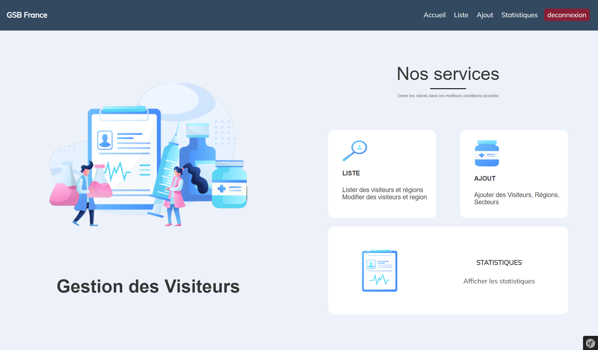
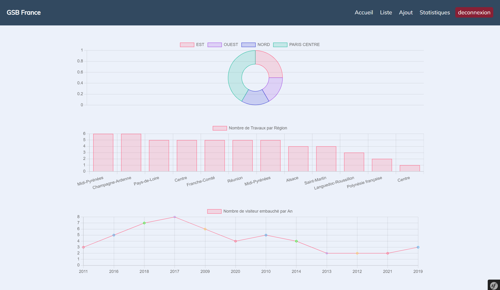
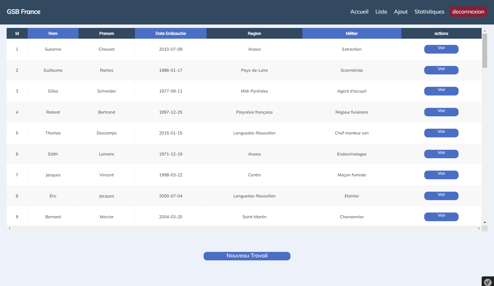
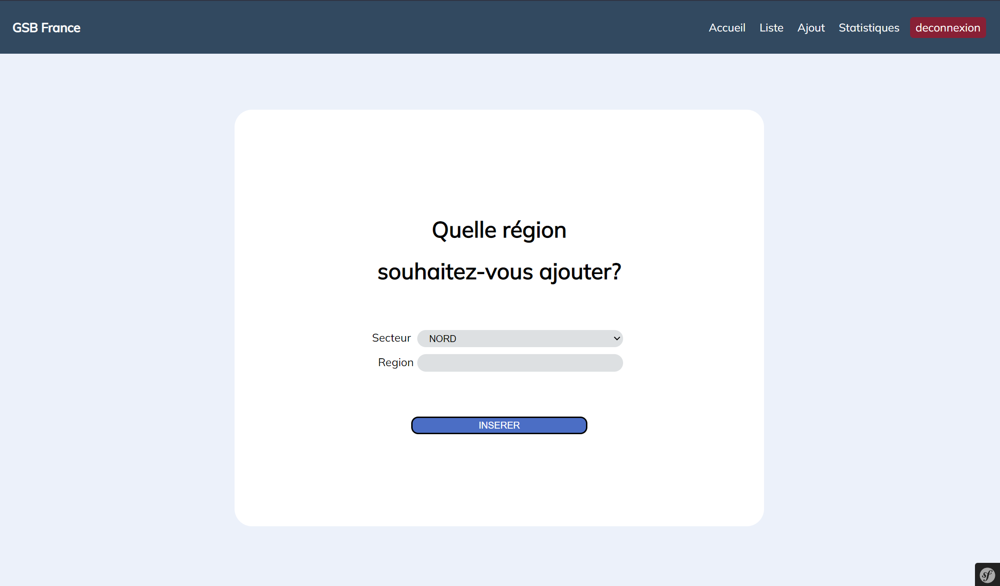

# GSB SYMFONY

## Informations
Ce projet à été réalisé en symfony 5 pour ma seconde année d'études.
GSB est un laboratoire pharmaceutique, mon but était de creer une application pour pouvoir modifier les régions et secteurs dans lequel un visiteur pouvait travailler.

## Installation

#### Faire un clone du projet 
 `$ git clone https://github.com/ilan990/gsb-Symfony.git`

#### Renommer le .env_exemple en .env et modifier la ligne correspondant à votre base de données
`$ mv .env_exemple .env`

#### Télécharger les vendor grâce à cette commande
`$ composer intall`

#### Pour ce projet j'ai utilisé FakerPHP pour avoir des fausses données dans ma base de données
 `$ composer require fakerphp/faker`

 `$ symfony console doctrine:fixtures:load`

## Quelques images du projet

